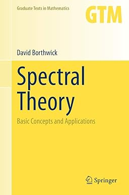

## UNDER CONSTRUCTION: MANY BROKEN LINKS!!

Welcome to the public homepage of **Math F617 Functional Analysis**, Spring 2024, in the [Dept. of Mathematics and Statistics](http://www.uaf.edu/dms/) at the [University of Alaska Fairbanks](http://www.uaf.edu/).

If you plan to be present on campus in Fairbanks during the semester, please sign up for the in-person "901" section (crn FIXME), and plan to attend lecture in FIXME.  If you are remote, signing up for the web-based "701" section (crn FIXME) is just fine!

#### Instructor:  [Ed Bueler](http://bueler.github.io/)

Email me at [elbueler@alaska.edu](mailto:elbueler@alaska.edu).  I hold [office hours](http://bueler.github.io/OffHrs.htm) in Chapman 306C.

### Canvas course page

Log in to [canvas.alaska.edu/courses/18441](https://canvas.alaska.edu/courses/18441) for the lecture Zoom link, Homework and Exam solutions, and to see your grades.

## UNDER CONSTRUCTION: MANY BROKEN LINKS!!

### Getting Started

* Attend lectures: MWF 2:15-3:15pm in Chapman 107, or online.

* Read the [Syllabus (PDF)](assets/general/S24/syllabus.pdf).

* See the [Schedule (PDF)](assets/general/S24/schedule.pdf).  Check it often for due dates, and for which topics come next!

* Check out the nearly-weekly [homework Assignments](homework).

* There are three Exams, two Midterm Quizzes and a Final.  All are in class, and the Final will happen at the scheduled time.  See the [Exams](exams) tab for review guides.

* What are we studying?  Check out these Wikipedia pages for the topics we will get to, in this approximate order:

    * FIXME

---
_Site design derived from [coordinated Calc I](https://uaf-math251.github.io/), an original [Jekyll](https://jekyllrb.com/) design by [David Maxwell](https://damaxwell.github.io/)._

